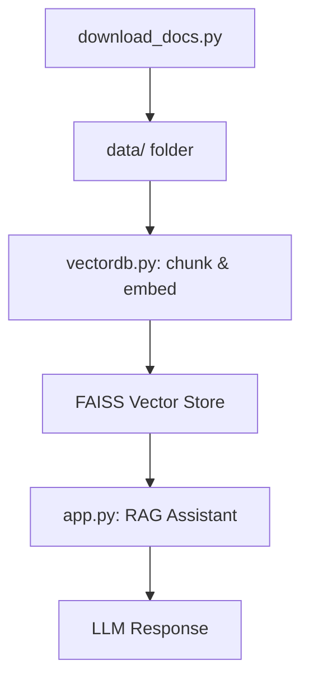

# LangChain RAG Assistant

A **Retrieval-Augmented Generation (RAG)** assistant built with **LangChain**, **FAISS**, and **LLM** (Groq).
It uses downloaded sections of the LangChain documentation as its knowledge base and provides context-aware responses to technical questions.

---

## Features

* **Local Knowledge Base** — uses a portion of LangChain documentation stored in a local `data/` folder.
* **Document Chunking** — splits large files into manageable text chunks for better retrieval.
* **FAISS Vector Database** — fast, efficient similarity search on embeddings.
* **Multiple LLM Backends** — works with Groq, OpenAI, or Google Gemini, depending on available API keys.
* **Interactive Q&A Loop** — ask questions and get answers grounded in documentation context.
* **Safe & Relevant Answers** — refuses unsafe or unrelated queries and avoids hallucinations.

---

## Project Architecture

The project is organised into three main components:

### 1. `download_docs.py` (Data Preparation)

* Downloads a portion of the **LangChain documentation**.
* Saves `.txt` files locally in the `data/` folder.
* Only needs to be run if you want to refresh or update the docs.

### 2. `vectordb.py` (Vector Database)

* Splits documents into smaller **chunks** using a text splitter.
* Generates embeddings using **SentenceTransformers** (`all-MiniLM-L6-v2`).
* Stores the embeddings in a **FAISS** database for fast similarity search.
* Provides methods to:

  * Add new documents to the DB.
  * Query for the most relevant chunks given a question.

### 3. `app.py` (RAG Assistant)

* Initialises an LLM (Groq, OpenAI, or Google Gemini).
* Retrieves relevant context from FAISS.
* Injects retrieved context into a **prompt template**.
* Passes the prompt to the LLM to generate a context-aware answer.
* Runs an **interactive Q&A loop** where users can type questions.

 **Data Flow:**



---

## ⚙️ Installation

Clone the repository and install dependencies:

```bash
git clone https://github.com/Ak-Dan/langchain-rag-assistant.git
cd langchain-rag-assistant
pip install -r requirements.txt
```

---

##  Setup

1. Create a `.env` file in the project root with at least one API key:

```env
# Choose one or more
OPENAI_API_KEY=your_openai_api_key_here
GROQ_API_KEY=your_groq_api_key_here
GOOGLE_API_KEY=your_google_api_key_here

# Optional: model names
OPENAI_MODEL=gpt-4o-mini
GROQ_MODEL=llama-3.1-8b-instant
GOOGLE_MODEL=gemini-2.0-flash
```

2. Make sure the **LangChain docs** are available:

   * Either run `download_docs.py` to fetch them.
   * Or manually place `.txt` files into the `data/` folder.

---

##  Usage

Run the assistant:

```bash
python app.py
```

You’ll see output like this:

```
Initializing RAG Assistant...
Using Groq model: llama-3.1-8b-instant
Loading embedding model: sentence-transformers/all-MiniLM-L6-v2
Vector database initialized with FAISS
RAG Assistant initialized successfully

Loading documents...
Loaded 13 sample documents
Prepared 486 chunks. Encoding embeddings...
All documents added to vector database
```

Then, interact with the assistant:

```
Enter a question or 'quit' to exit: What is LangChain?
```

---

##  Project Structure

```
├── app.py              # Main RAG Assistant
├── vectordb.py         # Vector DB (chunking + embeddings + FAISS)
├── download_docs.py    # Script to download LangChain docs
├── data/               # Folder containing downloaded docs (.txt)
├── requirements.txt    # Dependencies
├── .env                # API keys
└── README.md           # Documentation
```

---

## Notes

* If you already have `.txt` files in the `data/` folder, you **don’t need** to run `download_docs.py`.
* FAISS is **cross-platform** and avoids the metadata mismatch issues seen with ChromaDB on Windows.
* You can easily swap FAISS for another vector store if needed (e.g., Pinecone, Weaviate).

---

## Tech Stack

* **LangChain** – Orchestration framework
* **FAISS** – Vector database for embeddings
* **SentenceTransformers** – Embedding model (`all-MiniLM-L6-v2`)
* **Groq / OpenAI / Google Gemini** – LLM backends
* **Python 3.9+**

---

## Example Interaction

```
Enter a question or 'quit' to exit: What is a LangChain Chain?

Answer:
A LangChain Chain is a sequence of calls where the output of one step is the input to the next.
Chains enable developers to build more complex workflows by linking multiple components.
```

---

## License

This project is licensed under the **MIT License**.

---

